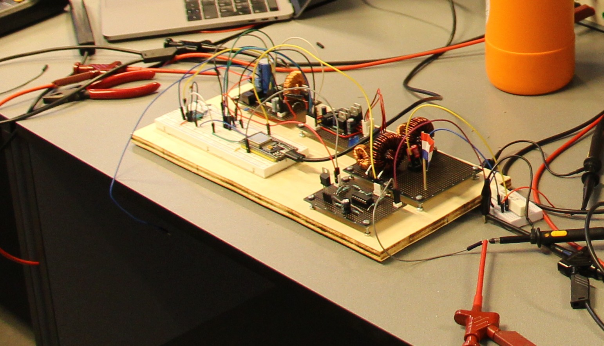

# Grid-Tie Solar Inverter

---

## Overview

## Schematic

---

### Pinout

| Pin | Description                      |
|-----|----------------------------------|
| 18  | H-Bridge PWM High                |
| 19  | H-Bridge PWM Low                 |
| 21  | Boost Converter PWM              |
| 16  | PV Voltage+Current ADC SDA       |
| 17  | PV Voltage+Current ADC SCL       |
| 35  | Grid Voltage Pin                 |
| 25  | DAC Out (For Debugging)          |
| 13  | Digital Test Pin (For Debugging) |
